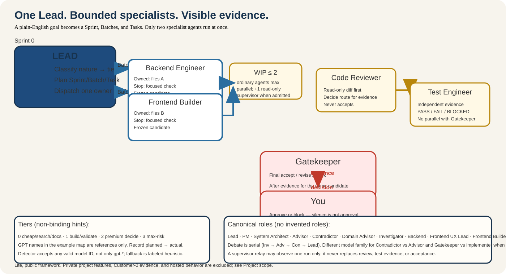

# coding-team

**Vibe-code, but don't build blind.** Turn a plain-English idea into one small,
reviewable change with a clear scope, useful proof, and your decision at the
end.

`coding-team` is a standalone public, lite framework. It provides role cards,
bounded work, evidence rules, and human gates that can be used by a project
without access to a private product or hosted service.

[Install](docs/installation.md) · [Project scope](docs/project-scope.md) · [See the workflow](docs/workflow.md) · [Meet the roles](docs/roles.md) · [Try the example](docs/examples/validation-scenario.md) · [Definitions](docs/definitions.md) · [Skills](docs/skills.md) · [Addons](docs/addons.md) · [Model pool](docs/model-pool-mapping.md) · [Adapters](docs/adapters.md)

## Why it helps

AI coding is fast. The hard part is knowing what the agent is changing, when
the work is small enough to review, what was actually tested, and whether it
is ready to ship.

coding-team makes those decisions visible:

- **Sprint → Batch → Task** keeps a big goal small enough to steer.
- **Role cards** make ownership and boundaries explicit.
- **WIP ≤ 2** limits concurrent tool-using work.
- **Human gates** protect irreversible actions.
- **Test Engineer → Gatekeeper** puts independent evidence before final acceptance.

The result is a visible path from request to reviewed change—not a promise of
more autonomy. You keep the final decision.

## See it in one minute

Start with one request. Make its boundary visible, run the focused check, and
pause for your decision when the evidence is ready or incomplete.


This illustrative visual shows the public loop: request → bounded work →
evidence → your decision. The [communication guide](docs/communication-style.md)
keeps the language clear without changing the underlying constraints or
evidence.


## How the multiagent orchestration works

The framework has one **Lead**. The Lead first checks the goal, the size of the
work, and what will prove it is done. Then the Lead assigns small tasks to the
right roles.

<picture>
  <source media="(max-width: 640px)" srcset="docs/examples/assets/coding-team-multiagent-mobile.svg">
  
</picture>

- **You give the goal:** outcome, limits, and the decisions that must stay with
  you.
- **Lead checks before assigning:** Is the task clear? Can one role own it? Is
  it small enough? What check will prove it works? If not, Lead asks the team
  or splits the work into Sprint → Batch → Task.
- **Team input is optional:** Product Manager, System Architect, Advisor,
  Contradictor, or a Domain Advisor joins only when their answer can change the
  task.
- **Builders implement:** Backend Engineer and Frontend Builder can work at the
  same time only when their files and dependencies do not conflict.
- **Tests match the risk:** builders run focused checks. For material or risky
  work, Test Engineer checks the result, then Gatekeeper accepts, revises, or
  blocks it.
- **Human gates:** commit, push/merge, release, and public export require an
  explicit yes. Silence, an agent's "approved" message, and a passing test are
  not approval.

### How Lead estimates task size

The public framework uses a rule-based check, not an automatic estimator.
Before assigning work, Lead checks for one owner, one concern, one result, and
a short run with a clear stop. If similar completed work has measured time,
Lead may use it as an estimate. If not, Lead says the estimate is unknown and
splits the task or runs a small fact-finding step. After the task, record the
actual time, outcome, and blocker so the next estimate has evidence.

## QA maturity

| QA path | Public status | When to use it |
|---|---|---|
| **Normal QA** | `AVAILABLE` | Default for ordinary, bounded changes |
| **Risky QA** | `EXPERIMENTAL` | Required when an existing high-risk trigger applies |

Risky QA is implemented and available for careful trial use. Its public
guidance is still being evaluated. It does not silently fall back to Normal QA
when a risky trigger is present, and it does not change the human approval
gates. See the [basic example](docs/examples/risky-qa-trial.md).

## A first bounded task

```text
Goal: add one small feature
Boundary: touch only the named files
Proof: run the focused check and report changed paths
Stop: pause for review before commit or release
```

Install the adapter for your host, start with one bounded task, and adapt the
framework to your project. The core stays host-neutral; Codex, Cursor, and
Cline bindings live under `adapters/`. See [Project scope](docs/project-scope.md)
for the public release boundary.

---

## Install in one command

For most people, the friendly entrypoint detects the available host and can
optionally prepare a first project. Press Enter to skip the project prompt:

```bash
./install.sh
```

It can optionally add a pointer to your first project:

```bash
./install.sh --project /path/to/your/project
```

If the folder is missing or cannot be updated, installation still completes
and the command explains how to prepare it later.

For CI, scripts, or a fully explicit setup, skip all prompts:

```bash
./install.sh --platform codex --no-questionnaire
```

## Advanced install and explicit extensions

The canonical installer links the selected adapter and conditional QA support:

```bash
./scripts/install-coding-team.sh --platform codex
```

There is one public installation path. Model maps and addons are explicit
extensions; see [Installation](docs/installation.md).

## What this is

| Layer | What it does |
|---|---|
| **Core** | Host-agnostic policy: roles, gates, WIP ≤ 2, nature → tier |
| **Skills** | Bundled engineering / quality / process / design packs |
| **Adapters** | Codex, Cursor, Cline runtime binding |
| **Addons** | PM Lean decision support — default OFF, explicit-only |

## How routing works

1. Lead classifies **nature** (N0–N5 / Consult / Docs).
2. Nature selects an abstract **tier**.
3. Lead uses a host-local approved `model-pool.map.md` slug when one exists.
4. Missing slug → next best; record `planned → actual` (never block start).

One-liner: **Premium decide. Eco build. Cheap search/docs. Human gate for irreversible risk.**

## Domain Expert (`[Domain]-Advisor`)

No fixed Talent-Career role. When specialty judgment is needed, Lead **asks for the domain**, then maps:

| Display | Instance ID |
|---|---|
| Talent-Advisor | `talent-advisor` |
| Strategic-Advisor | `strategic-advisor` |
| Security-Advisor | `security-advisor` |
| … | `{domain}-advisor` |

Template: `core/roles/domain-advisor.md` · Rules: `core/domain-advisors.md` · Roles doc: [docs/roles.md](docs/roles.md).

## License

MIT for framework files. Third-party notices: [THIRD_PARTY_NOTICES.md](THIRD_PARTY_NOTICES.md).
