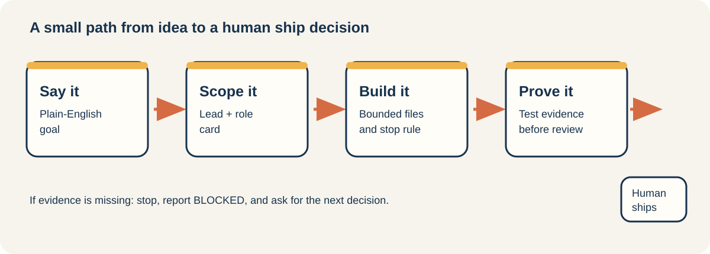
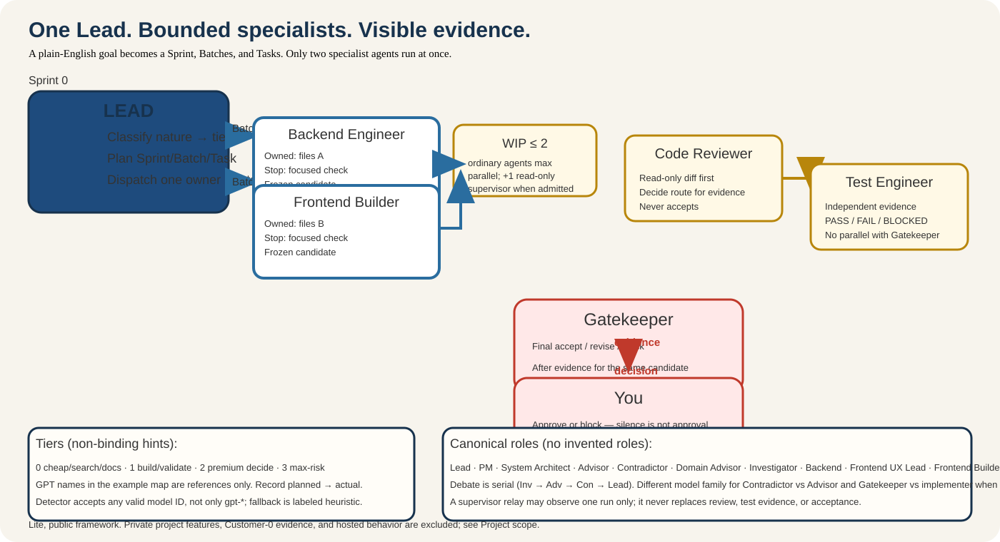

# coding-team

**Ngôn ngữ:** [English](README.md) · **Tiếng Việt**

**Vibe-code thỏa thích, nhưng đừng code mất kiểm soát.** Biến một ý tưởng nói bằng ngôn ngữ tự nhiên thành một thay đổi nhỏ gọn, dễ kiểm tra, khoanh vùng rõ ràng, có bằng chứng chạy thử thực tế và bạn luôn là người ra quyết định cuối cùng.

`coding-team` là một framework mã nguồn mở, gọn nhẹ (lite) và hoàn toàn độc lập. Framework này cung cấp: các thẻ vai trò (role cards), quy tắc khoanh vùng công việc, kiểm tra bằng chứng thực tế và các chốt duyệt bởi con người — giúp dự án của bạn làm việc hiệu quả với AI mà không cần phụ thuộc vào dịch vụ đám mây trả phí hay công cụ nội bộ riêng biệt.

[Cài đặt](docs/installation.md) · [Phạm vi dự án](docs/project-scope.md) · [Xem luồng công việc](docs/workflow.md) · [Các vai trò](docs/roles.md) · [Thử ví dụ mẫu](docs/examples/validation-scenario.md) · [Thuật ngữ & Định nghĩa](docs/definitions.md) · [Kỹ năng (Skills)](docs/skills.md) · [Addon mở rộng](docs/addons.md) · [Bảng chọn Model](docs/model-pool-mapping.md) · [Bộ kết nối (Adapters)](docs/adapters.md)

> Bản tiếng Việt này được tinh chỉnh thân thiện, dễ đọc cho người làm sản phẩm và cộng đồng vibe-coding. Bạn có thể tham chiếu bản gốc [English](README.md) bất cứ lúc nào.

## Vì sao framework này giúp ích cho bạn?

Dùng AI viết code thì cực nhanh. Nhưng điều đau đầu nhất là:

- Không biết AI đang âm thầm chỉnh sửa những file nào?
- Khối lượng việc đã đủ nhỏ gọn để bạn kiểm tra (review) chưa, hay AI đang làm một lèo cả đống thứ?
- AI đã kiểm tra chạy thử thật chưa, hay chỉ "chém gió" là đã xong?
- Code này đã thực sự ổn định để bạn tự tin đưa lên chạy (ship) hay chưa?

`coding-team` giúp mọi thứ minh bạch và bạn luôn nắm quyền kiểm soát:

- **Sprint → Batch → Task:** Chia nhỏ mục tiêu lớn thành từng việc tí hon để bạn dễ lái theo ý mình.
- **Thẻ vai trò (Role cards):** Phân chia rạch ròi AI nào làm việc nấy, không dẫm chân lên nhau.
- **Tối đa 2 việc cùng lúc (WIP ≤ 2):** Giữ lượng việc song song luôn trong tầm mắt, không lo bị quá tải khi cần duyệt lại.
- **Con người chốt duyệt (Human gates):** Những hành động quan trọng (commit, push/merge, release...) bắt buộc bạn phải đồng ý, AI không được tự ý thực hiện.
- **Kiểm thử độc lập trước khi nghiệm thu (Test Engineer → Gatekeeper):** Phải có bằng chứng chạy thử thực tế mới được tính là xong việc.

Kết quả: Bạn có một lộ trình rõ ràng từ ý tưởng ban đầu đến sản phẩm đã được kiểm tra cẩn thận — không phải là để AI tự tung tự tác. Bạn luôn là người quyết định cuối cùng!

## Hiểu nhanh trong 1 phút

Mọi thứ bắt đầu bằng một yêu cầu của bạn: Khoanh vùng các file cần chạm vào, chạy thử kiểm tra đúng phần đó, rồi tạm dừng chờ bạn gật đầu khi bằng chứng đã rõ ràng (hoặc báo lại nếu chưa đạt).



Sơ đồ trên mô tả vòng lặp cốt lõi: **Yêu cầu → Khoanh vùng làm việc → Bằng chứng chạy thử → Bạn quyết định**. [Hướng dẫn giao tiếp](docs/communication-style.md) giúp giữ cách nói chuyện luôn ngắn gọn, dễ hiểu mà vẫn đảm bảo tính chặt chẽ.

## Đội ngũ AI Agent phối hợp với nhau như thế nào?

Cả team luôn có một AI đóng vai trò **Trưởng nhóm (Lead)**. Lead sẽ xem kỹ yêu cầu của bạn, đánh giá độ lớn của việc cần làm, xác định cần kiểm tra gì để chứng minh là xong, sau đó mới chia việc cho đúng người đúng vai.

<picture>
  <source media="(max-width: 640px)" srcset="docs/examples/assets/coding-team-multiagent-mobile.svg">
  
</picture>

- **Bạn đưa ra mục tiêu:** Muốn kết quả thế nào, giới hạn ra sao và những quyết định nào bắt buộc phải hỏi bạn.
- **Lead thẩm định trước khi giao:** Việc đã rõ ràng chưa? Một vai trò có thể làm trọn vẹn không? Việc có đủ nhỏ gọn không? Kiểm tra bằng cách nào để biết là chạy được? Nếu chưa rõ, Lead sẽ hỏi thêm hoặc tự động chẻ nhỏ việc ra thành từng phần (Sprint → Batch → Task).
- **Các vai trò tư vấn chỉ tham gia khi cần:** Product Manager (PM), Kiến trúc sư hệ thống (System Architect), Cố vấn kỹ thuật (Advisor), Người phản biện (Contradictor) hay Chuyên gia chuyên ngành (Domain Advisor) chỉ xuất hiện khi ý kiến của họ thực sự giúp định hình giải pháp.
- **Builder viết code:** Backend Engineer và Frontend Builder chỉ làm việc song song khi không đụng chạm chung file hoặc thư viện của nhau.
- **Kiểm thử theo mức độ rủi ro:** Người viết code tự chạy kiểm tra cơ bản. Với các thay đổi quan trọng hoặc rủi ro cao, Test Engineer sẽ vào cuộc để kiểm tra độc lập, sau đó Gatekeeper sẽ quyết định: duyệt, yêu cầu sửa tiếp hay chặn lại.
- **Con người chốt duyệt:** Các thao tác quan trọng như commit, push/merge lên Git, release ra ngoài... bắt buộc phải có cái gật đầu ("yes") rõ ràng từ bạn. Sự im lặng của bạn, lời tự khen "em làm xong rồi" của AI, hay kể cả test xanh — đều không được tính là bạn đã duyệt!

### Cách Lead ước lượng độ lớn công việc

Framework không đoán mò thời gian. Trước khi giao việc, Lead kiểm tra 4 yếu tố: đúng 1 người phụ trách, đúng 1 mối quan tâm chính, đúng 1 kết quả cụ thể, và hoàn thành nhanh với điểm dừng rõ ràng. Nếu các việc tương tự trước đây từng ghi nhận thời gian, Lead sẽ dùng làm mốc ước lượng. Nếu chưa có số liệu, Lead sẽ thẳng thắn báo là chưa rõ thời gian và chia nhỏ việc ra hoặc làm một bước thăm dò nhanh. Khi làm xong, hệ thống lưu lại thời gian và kết quả thực tế để lần sau ước lượng chuẩn xác hơn.

## Các mức độ kiểm thử (QA)

| Chế độ QA | Trạng thái | Khi nào nên dùng |
| --- | --- | --- |
| **Normal QA** (Thông thường) | `AVAILABLE` (Sẵn sàng) | Mặc định cho các thay đổi nhỏ, đã khoanh vùng rõ ràng |
| **Risky QA** (Nâng cao cho việc rủi ro) | `EXPERIMENTAL` (Thử nghiệm) | Bắt buộc khi đụng chạm vào phần nhạy cảm, rủi ro cao |

Risky QA đã sẵn sàng để bạn dùng thử thận trọng. Khi gặp tác vụ rủi ro, hệ thống sẽ không tự ý hạ cấp về Normal QA, và các chốt duyệt của con người vẫn giữ nguyên 100%. Xem [ví dụ cơ bản](docs/examples/risky-qa-trial.md).

## Thử ngay một task mẫu đầu tiên

```text
Mục tiêu (Goal): Thêm một tính năng nhỏ gọn
Phạm vi (Boundary): Chỉ sửa đúng các file được chỉ định
Bằng chứng (Proof): Chạy lệnh kiểm tra tính năng đó và liệt kê các file đã đổi
Dừng lại (Stop): Dừng lại chờ bạn xem xét trước khi commit hay release
```

Chỉ cần cài adapter cho công cụ bạn đang dùng (Codex, Cursor hay Cline), bắt đầu bằng một task nhỏ như trên và áp dụng dần vào dự án của bạn. Phần core hoàn toàn độc lập với công cụ; adapter kết nối nằm trong thư mục `adapters/`. Xem [Phạm vi dự án](docs/project-scope.md) để biết thêm chi tiết.

---

## Cài đặt bằng 1 dòng lệnh

Với đa số người dùng, chỉ cần chạy script cài đặt tự động — nó sẽ tự nhận diện bạn đang dùng Codex, Cursor hay Cline và hỏi bạn có muốn liên kết luôn vào dự án nào không (nhấn Enter nếu muốn bỏ qua):

```bash
./install.sh
```

Nếu muốn gắn sẵn vào thư mục dự án của bạn ngay từ đầu:

```bash
./install.sh --project /duong-dan/toi/du-an-cua-ban
```

Nếu thư mục chưa có hoặc chưa cấp quyền ghi, quá trình cài đặt vẫn hoàn tất và sẽ hướng dẫn bạn cách thiết lập sau.

Dành cho môi trường CI, script tự động hoặc khi muốn bỏ qua mọi câu hỏi:

```bash
./install.sh --platform codex --no-questionnaire
```

## Bắt đầu một task ngay trong khung chat

Framework tích hợp sẵn một bộ kỹ năng quy trình nhỏ gọn. Kỹ năng mở đầu dễ dùng nhất là `plain-task-start`: nó giúp chuyển bất kỳ câu lệnh nào bạn chat thành một thẻ công việc 4 dòng rõ ràng — **Mục tiêu (Goal), Phạm vi (Scope), Bằng chứng (Proof), Điểm dừng (Stop)** — **trước khi AI kịp đụng vào bất kỳ file code nào!**

Kỹ năng này nằm sẵn trong thư mục `skills/process/plain-task-start/` và tự nạp qua biến `CODING_TEAM_ROOT`, bạn không cần cài thêm gì cả. Chỉ cần nhắn cho AI trong cửa sổ chat:

```text
Dùng skills/process/plain-task-start/ để tạo task card cho yêu cầu này:
Thêm nút bật/tắt dark mode vào trang cài đặt (settings)
```

AI sẽ trả lời ngay bằng một thẻ tóm tắt và dừng lại chờ bạn duyệt:

```text
Goal: Thêm nút bật/tắt dark mode vào trang cài đặt
Scope: Chỉ chỉnh sửa trong thư mục src/settings/*
Proof: Bấm nút đổi được màu xem trước trên trang /settings
Stop: Dừng lại ngay sau khi kiểm tra xong giao diện, trước khi làm bất kỳ thao tác commit nào
```

Thẻ này chỉ dùng để chốt kế hoạch trước khi làm — nó chưa sửa code, không tự duyệt và không thay thế bạn. Xem [Skills](docs/skills.md) để khám phá thêm các bộ kỹ năng khác.

## Cài đặt nâng cao và các phần mở rộng

Script cài đặt chuẩn giúp tạo liên kết (symlink) cho adapter và bộ hỗ trợ QA:

```bash
./scripts/install-coding-team.sh --platform codex
```

Dự án chỉ có một luồng cài đặt chuẩn duy nhất. Các bảng cấu hình model (model maps) và addon là các phần mở rộng tùy chọn; xem thêm tại [Hướng dẫn cài đặt](docs/installation.md).

## Cấu trúc của Framework gồm những gì?

| Tầng | Vai trò & Chức năng |
| --- | --- |
| **Core** | Bộ quy tắc chung: vai trò, chốt duyệt, giới hạn — hoạt động y hệt nhau trên Codex, Cursor hay Cline |
| **Skills** | Các gói kỹ năng dựng sẵn: kỹ thuật (engineering), chất lượng (quality), quy trình (process), thiết kế (design) |
| **Adapters** | Cầu nối giúp tích hợp mượt mà vào runtime của Codex, Cursor hoặc Cline |
| **Addons** | Bộ hỗ trợ phân tích sản phẩm (PM Lean) — mặc định TẮT, chỉ bật khi bạn cần |

## Cơ chế điều phối Model (Routing)

Điều phối (Routing) là cách phân công xem loại việc nào nên giao cho model AI nào làm để vừa tiết kiệm chi phí vừa đạt kết quả tốt nhất.

Nói một cách dân dã nhất: **Phân loại việc → Chọn năng lực phù hợp → Dùng model mà bạn đã cấp quyền.**

1. **Phân loại tác vụ (Nature):** Lead xếp việc vào các nhóm (từ việc nhẹ như tra cứu đọc file, viết code thông thường, đến việc nặng rủi ro cao cần hỏi con người trước — framework chia thành N0–N5 kèm nhóm Consult và Docs; xem [Định nghĩa](docs/definitions.md)).
2. **Chọn cấp độ năng lực (Tier):** Mỗi loại việc cần một năng lực tương ứng: ví dụ việc đơn giản chỉ cần model giá rẻ, việc code cần model ổn định, việc đánh giá kiến trúc cần model thông minh nhất (tier premium). Tier chỉ mức năng lực mong muốn, không chỉ định cứng một hãng AI nào.
3. **Gọi đúng Model (Slug):** Lead sẽ lấy tên model (slug) tương ứng mà bạn đã cấu hình trong file `model-pool.map.md`.
4. **Không có model chỉ định sẵn?** Lead tự động dùng model tốt nhất kế tiếp và ghi lại đối chiếu (không bao giờ làm tắc nghẽn công việc).

Tóm tắt trong một câu:
> **Model xịn nhất (Premium) để ra quyết định khó · Model cân bằng (Eco) để viết code · Model giá rẻ (Cheap) để tìm kiếm và đọc tài liệu · Con người tự tay duyệt những việc rủi ro không thể đảo ngược.**

## Chuyên gia chuyên ngành (`[Domain]-Advisor`)

Framework không gắn cứng một vai trò ngành dọc nào (như Cố vấn Nhân sự, Tài chính...). Khi gặp bài toán cần kiến thức chuyên sâu của một ngành cụ thể, Lead sẽ **xác định lĩnh vực chuyên môn (domain)** cần thiết và tự động ánh xạ vai trò:

| Tên hiển thị | Mã định danh (Instance ID) |
| --- | --- |
| Cố vấn Nhân sự (Talent-Advisor) | `talent-advisor` |
| Cố vấn Chiến lược (Strategic-Advisor) | `strategic-advisor` |
| Cố vấn Bảo mật (Security-Advisor) | `security-advisor` |
| … | `{domain}-advisor` |

File mẫu: `core/roles/domain-advisor.md` · Bộ quy tắc: `core/domain-advisors.md` · Tài liệu các vai trò: [docs/roles.md](docs/roles.md).

## Giấy phép (License)

Mã nguồn framework phát hành theo giấy phép MIT. Thông báo về các thư viện bên thứ ba: [THIRD_PARTY_NOTICES.md](THIRD_PARTY_NOTICES.md).
